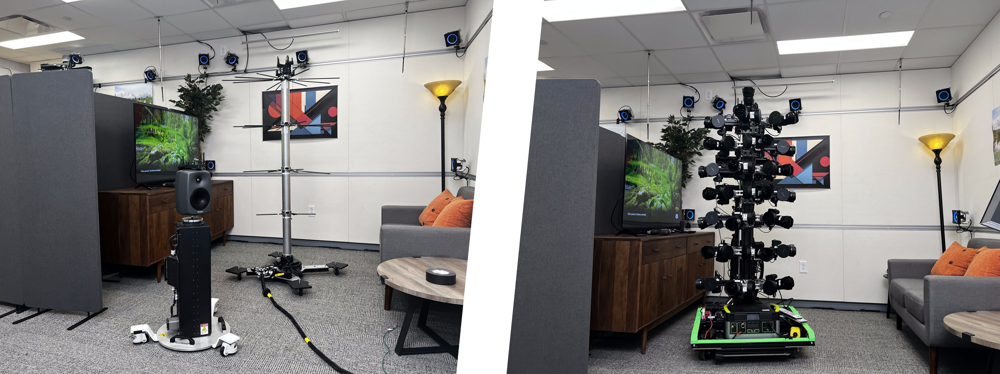

<a rel="license" href="http://creativecommons.org/licenses/by-nc/4.0/"></a> This work is licensed under a <a rel="license" href="http://creativecommons.org/licenses/by-nc/4.0/">Creative Commons Attribution-NonCommercial 4.0 International License</a>.

# Real Acoustic Fields: An Audio-Visual Room Acoustics Dataset and Benchmark [CVPR 2024]
<div align = "center"></div>
<p align="center" style="margin: 2em auto;">
    <a href='https://facebookresearch.github.io/real-acoustic-fields/' style='padding-left: 0.5rem;'></a>
    <a href=''></a>
  </p>
<!-- <p align="left" style="font-size:20px; font-weight:600;">CVPR 2024</p> -->

We present the Real Acoustic Fields (RAF) dataset that captures real acoustic room data from multiple modalities. The dataset includes high-quality and densely captured room impulse response data paired with multi-view images, and precise 6DoF pose tracking data for sound emitters and listeners in the rooms.


## Dataset
The [Real Acoustic Fields dataset]() is hosted on AWS S3.
We recommend using the AWS command line interface (AWS CLI), see [AWS CLI installation instructions](https://docs.aws.amazon.com/cli/latest/userguide/getting-started-install.html).

The RIR data is organized as follows:
```
    ├───data
    │   ├───000000
    │          rir.wav
    │          rx_pos.txt
    │          tx_pos.txt
    │   ├───000001
    :   :
    ├───metadata
    │      all_rx_pos.txt
    │      all_tx_pos.txt
```
The rx_pos.txt file contains the receiver's 3D location (xyz) in the room. As we used omni-directional microphones, the orientation isn't required.

The tx_pos.txt file contains the transmitter's (loudspeaker's) 3D orientation and 3D location (xyz) in the room. The orientation is given in quaternions, using the real-part last format: xyzW. The first four values in the file represent the loudspeaker's orientation, while the last three values indicate its 3D location.

The metadata subfolder consolidates all the receiver and transmitter data into two CSV files. Each row in these files corresponds to a subfolder in the data section. For instance, the first row corresponds to the folder data\000000, while row 4568 corresponds to the folder data\004568.

The all the 3D positions are in meters. 

### 🔽 Download Room Impulse Respose (RIR) Data
<a href="https://fb-baas-f32eacb9-8abb-11eb-b2b8-4857dd089e15.s3.amazonaws.com/real_acoustic_fields/rir/archived/index.html"> Preview link </a>

Step 1. Increase the number of concurrent requests from 10 to 100 to download smaller files faster.
```
$ aws configure set default.s3.max_concurrent_requests 100
```
Step 2. Download the entire RAF RIR dataset (~21.6 GB).
```
$ mkdir raf_dataset && cd raf_dataset
$ aws s3 sync --no-sign-request s3://fb-baas-f32eacb9-8abb-11eb-b2b8-4857dd089e15/real_acoustic_fields/rir .
```
Step 3. Use the zip command to combine the split zip files into a single zip archive.
```
$ zip -F raf_emptyroom.zip --out single-archive_emptyroom.zip
$ zip -F raf_furnishedroom.zip --out single-archive_furnishedroom.zip
```
Step 4. Now we can use unzip to open our combined archive.
```
$ unzip single-archive_emptyroom.zip
$ unzip single-archive_furnishedroom.zip
```
Step 5. Clean up
```
$ rm  raf_*room.z??
```
### 🔽 Download Visual data
```
TBA
```

## Citation
If you find this repository and dataset useful in your research, please consider giving a star ⭐ and cite our CVPR 2024 paper by using the following BibTeX entrys.
```
@inproceedings{chen2024RAF,
      author    = { Chen, Ziyang and
                    Gebru, Israel D. and
                    Richardt, Christian and
                    Kumar, Anurag and
                    Laney, William and
                    Owens, Andrew and
                    Richard, Alexander},
      title     = {Real Acoustic Fields: An Audio-Visual Room Acoustics Dataset and Benchmark},
      journal   = {The IEEE / CVF Computer Vision and Pattern Recognition Conference (CVPR)},
      year      = {2024},
    }
```

## License
This work is licensed under a <a rel="license" href="http://creativecommons.org/licenses/by-nc/4.0/">Creative Commons Attribution-NonCommercial 4.0 International License</a>, as found in the LICENSE file.
